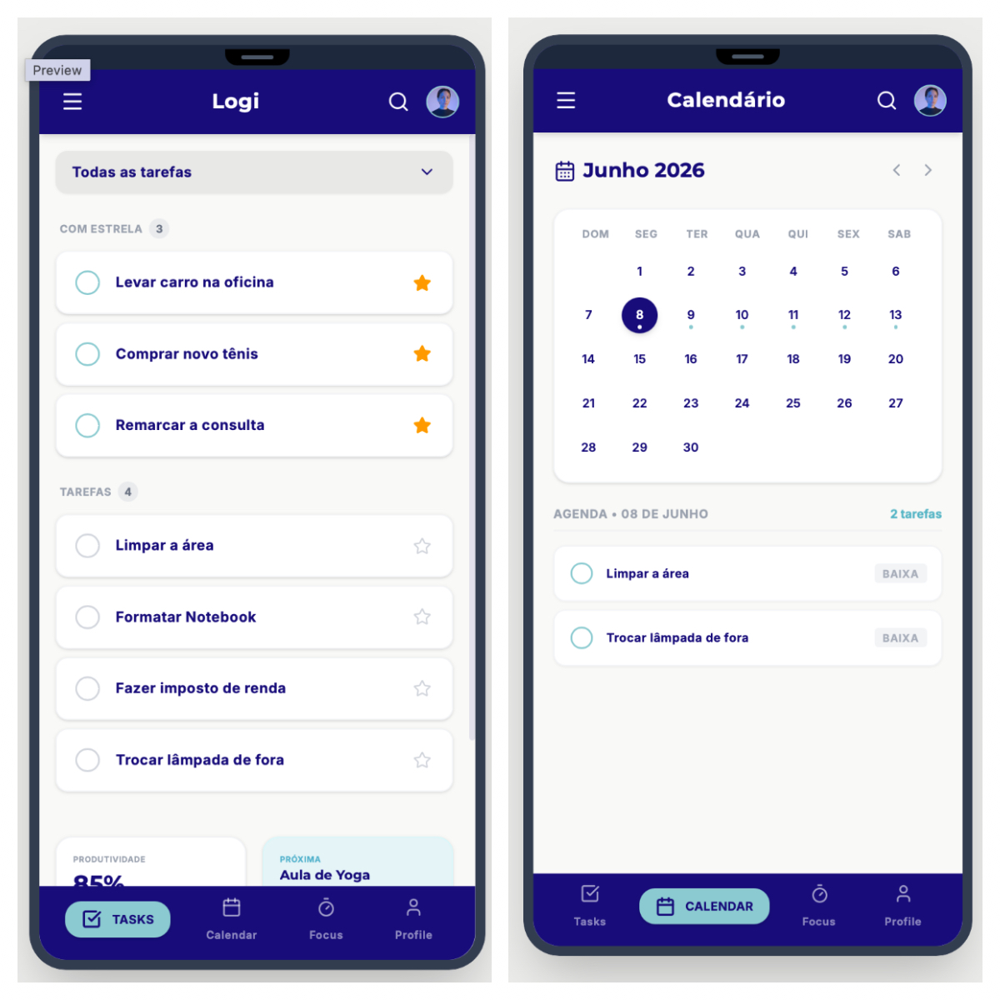

# Aplicativo de Lista de Tarefas: Logi

Aplicativo para gestão de tarefas, projetos e metas. Inclui calendário e grafico de produtividade para acompanhamento.

Projeto desenvolvido durante a disciplina:
- Projeto de Interface Web - 2º Ano Técnico em Informática
- Professor: Thiago Guimarães Tavares

## Sobre o projeto

O projeto foi projetado utilizando Whimiscal como ferramenta de prototipagem para o desenvolvimento do layout de média fidelidade.

Posteriormente utilizou-se o Google Stitch como ferramenta para criar a interface grafica e identidade visual do aplicativo.

Na sequência foi utilizado o Google Ai Studio para criação do aplicativo em si.

## Para Rodar Localmente:

- Clone este repositório e acesse o diretório do projeto

**Prerequisitos:**  Node.js

1. Instale as dependências com npm:
   `npm install`
2. Para rodar o aplicativo inicie o servidor:
   `npm run dev`
3. Insira a url informada ao final do comando no seu navedor de internet